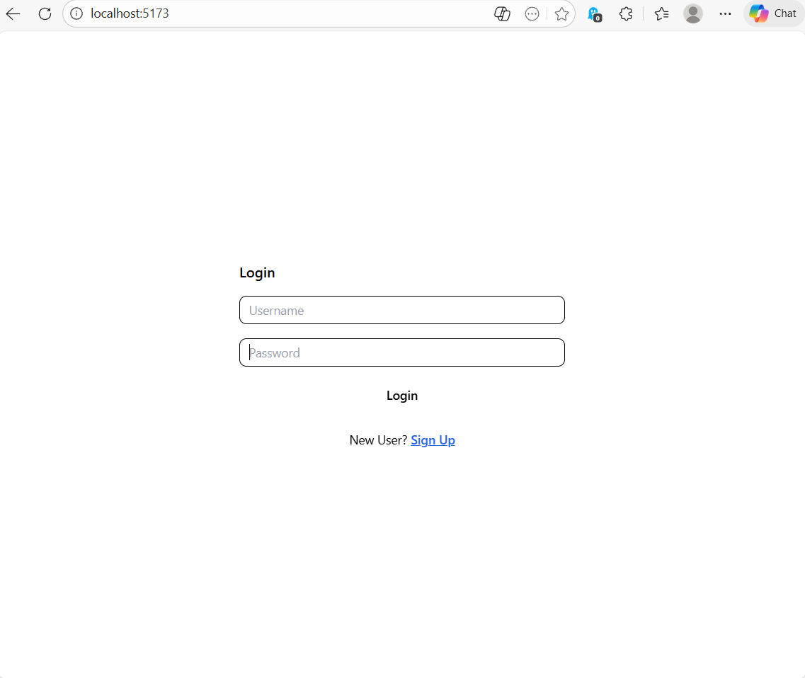
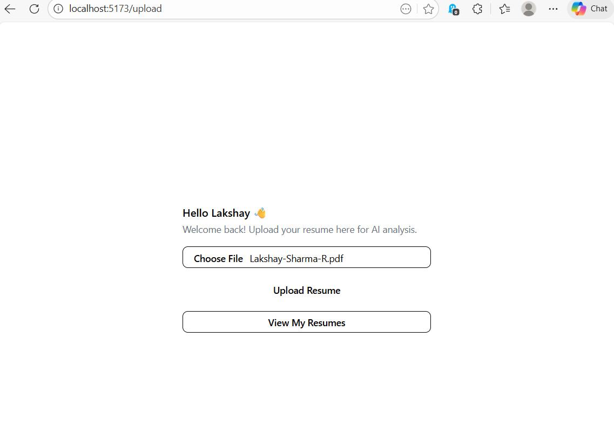
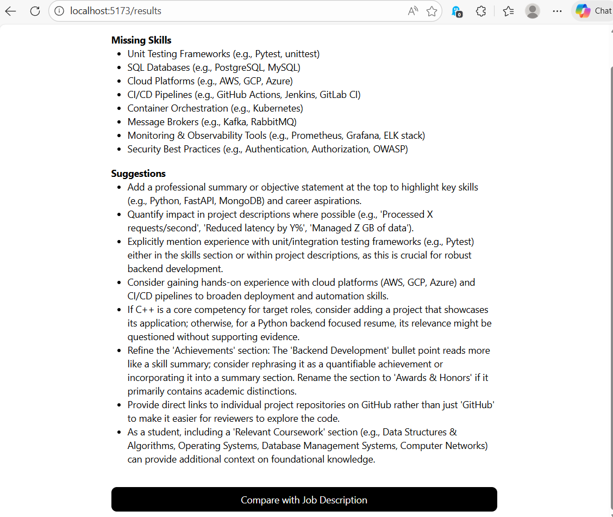
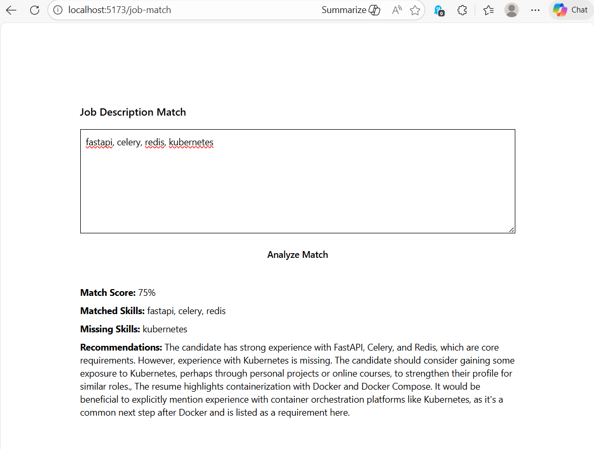
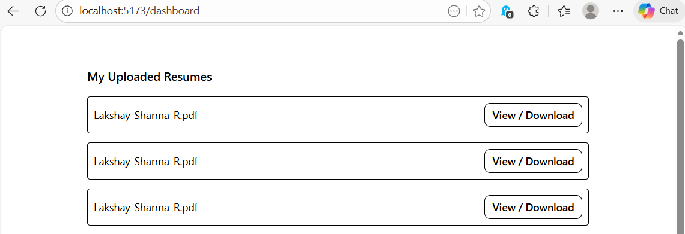

# AI Resume Analyzer

A web application that analyzes your resume using AI and helps match it with job descriptions. Built with **React**, **Django REST Framework**, and **Google Gemini AI**.

---

## Features

- User Signup/Login with JWT authentication.
- Upload PDF resumes for AI-based analysis.
- Get **ATS score**, detected skills, missing skills, and suggestions.
- Compare resumes with job descriptions to get match score and recommendations.
- Dashboard to view and download all previously uploaded resumes.

---

## Tech Stack

- **Frontend**: React, Tailwind CSS
- **Backend**: Django, Django REST Framework
- **AI**: Google Gemini API (`google.genai`)
- **Database**: SQLite (default) or PostgreSQL for production
- **Authentication**: JWT tokens

---

## Screenshots

**Login Page**  


**Upload Resume Page**  


**Results Page (AI Analysis)**  


**Job Match Page**  


**Dashboard**  


---

## Getting Started

### Frontend
- ```bash
- cd frontend
- npm install
- npm start

### Backend

- ```bash
- cd backend
- python -m venv .venv

# Linux / MacOS
- source .venv/bin/activate

# Windows
- .venv\Scripts\activate

- pip install -r requirements.txt
- python manage.py migrate
- python manage.py runserver

- Make sure to add your GEMINI_API_KEY in Django settings.

## Usage

- Sign up or log in.

- Upload your resume in PDF format.

- View AI analysis (score, detected skills, missing skills, suggestions).

- Enter a job description to check match score and recommendations.

- Use the dashboard to view and download previously uploaded resumes.   
